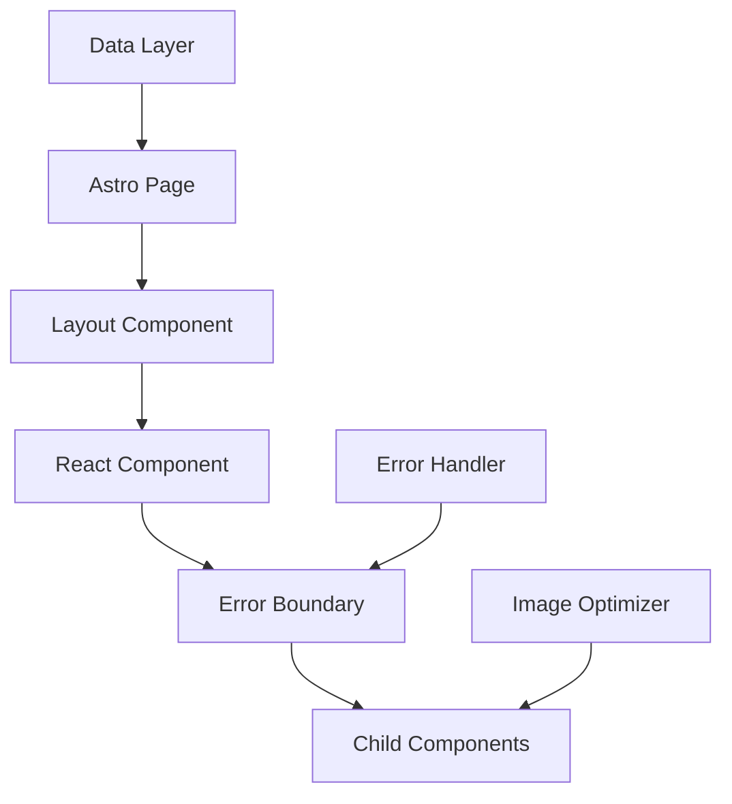

# 🏗️ Architecture Guide

This document provides an overview of the project architecture, design decisions, and technical implementation details.

## 📋 Table of Contents

- [Overview](#overview)
- [Technology Stack](#technology-stack)
- [Project Structure](#project-structure)
- [Component Architecture](#component-architecture)
- [Data Flow](#data-flow)
- [Performance Optimizations](#performance-optimizations)
- [Error Handling](#error-handling)
- [Internationalization](#internationalization)
- [Build Process](#build-process)

## 🎯 Overview

This portfolio template is built using **Astro** as the primary framework, leveraging its static site generation capabilities for optimal performance. The architecture follows modern web development best practices with a focus on:

- **Performance**: Static generation, image optimization, and code splitting
- **Developer Experience**: TypeScript, ESLint, Prettier, and pre-commit hooks
- **Maintainability**: Modular component structure and clear separation of concerns
- **Accessibility**: Semantic HTML and proper ARIA attributes
- **SEO**: Meta tags, structured data, and sitemap generation

## 🛠️ Technology Stack

### Core Framework
- **[Astro 5.13.9](https://astro.build/)** - Static site generator with component islands
- **[React 19.1.0](https://reactjs.org/)** - Interactive UI components
- **[TypeScript 5.0+](https://www.typescriptlang.org/)** - Type safety and developer experience

### Styling & UI
- **[Tailwind CSS 4.1.3](https://tailwindcss.com/)** - Utility-first CSS framework
- **[DaisyUI 5.0.50](https://daisyui.com/)** - Component library for Tailwind
- **[HeroUI 2.7.9](https://heroui.com/)** - Modern React component library
- **[Framer Motion 12.19.1](https://www.framer.com/motion/)** - Animation library

### Development Tools
- **[ESLint 9.36.0](https://eslint.org/)** - Code linting
- **[Prettier 3.6.2](https://prettier.io/)** - Code formatting
- **[Husky 9.0.11](https://typicode.github.io/husky/)** - Git hooks
- **[lint-staged 15.2.7](https://github.com/okonet/lint-staged)** - Pre-commit linting

### Build & Optimization
- **[Vite](https://vitejs.dev/)** - Build tool and dev server
- **[Sharp](https://sharp.pixelplumbing.com/)** - Image processing
- **[Rollup](https://rollupjs.org/)** - Module bundler

## 📁 Project Structure

```
DesignPhotographyPortfolio/
├── public/                     # Static assets
│   ├── favicon/               # Favicon files
│   └── images/                # Optimized images
├── src/
│   ├── components/            # Reusable components
│   │   ├── common/           # Shared components
│   │   │   ├── ErrorBoundary.tsx
│   │   │   ├── Image.tsx
│   │   │   └── Header.astro
│   │   ├── index/            # Homepage components
│   │   ├── pages/            # Page-specific components
│   │   └── works/            # Portfolio components
│   ├── data/                 # Content and configuration
│   │   ├── pages/            # Markdown pages
│   │   └── works/            # Portfolio data
│   ├── i18n/                 # Internationalization
│   │   └── design/           # Translation files
│   ├── layouts/              # Page layouts
│   │   ├── BaseLayout.astro
│   │   └── PageLayout.astro
│   ├── lib/                  # Utility functions
│   │   ├── errorHandler.ts   # Error handling utilities
│   │   ├── getWorks.ts       # Portfolio data fetching
│   │   └── getScreenType.ts  # Responsive utilities
│   ├── pages/                # Astro pages (routing)
│   │   ├── en/               # English pages
│   │   ├── ru/               # Russian pages
│   │   └── [work_id].astro   # Dynamic portfolio pages
│   └── styles/               # Global styles
│       ├── global.css        # Tailwind and global styles
│       └── animate.css       # Custom animations
├── scripts/                  # Build and utility scripts
├── docs/                     # Documentation
└── config files              # Configuration files
```

## 🧩 Component Architecture

### Component Hierarchy

```
BaseLayout.astro
├── Header.astro
├── PageLayout.astro
│   ├── AllImageGrid.tsx (Homepage)
│   ├── MemberGrid.astro (Portfolio)
│   └── CustomFloatBtns.astro
└── ErrorBoundary.tsx (Wraps React components)
```

### Component Types

#### 1. **Astro Components** (`.astro`)
- Server-side rendered
- Zero JavaScript by default
- Used for layouts and static content
- Examples: `BaseLayout.astro`, `Header.astro`

#### 2. **React Components** (`.tsx`)
- Client-side interactive components
- Hydrated with `client:load` directive
- Examples: `AllImageGrid.tsx`, `Image.tsx`

#### 3. **Hybrid Components**
- Astro components that include React components
- Best of both worlds: SSR + interactivity

### Component Communication



## 🔄 Data Flow

### 1. **Content Collection System**
```typescript
// Content is defined in content.config.ts
const works = defineCollection({
  loader: glob({ pattern: '**/*.md', base: './src/data/works' }),
  schema: z.object({ base: z.string() }),
});
```

### 2. **Data Fetching**
```typescript
// getWorks.ts - Centralized data fetching
export const getWorks = async () => {
  return handleAsyncError(
    async () => {
      const imageInfo = await getCollection('imageInfo');
      const worksData = await getCollection('works');
      // Process and combine data
    },
    [], // fallback value
    'Failed to load works data'
  );
};
```

### 3. **Component Props Flow**
```
Astro Page → getWorks() → Process Data → Pass to Components
```

## ⚡ Performance Optimizations

### 1. **Static Site Generation**
- All pages are pre-rendered at build time
- No server-side rendering at runtime
- Optimal Core Web Vitals scores

### 2. **Image Optimization**
```typescript
// Automatic WebP/AVIF conversion
const imageFormats = ['webp', 'avif'];
// Lazy loading with Intersection Observer
loading="lazy"
```

### 3. **Code Splitting**
```javascript
// Manual chunks for optimal caching
manualChunks: {
  vendor: ['react', 'react-dom'],
  ui: ['@heroui/react', '@heroicons/react'],
  utils: ['clsx', 'tailwind-merge'],
}
```

### 4. **Bundle Optimization**
- Terser minification with console.log removal
- Tree shaking for unused code elimination
- Preloading critical resources

## 🛡️ Error Handling

### 1. **Error Boundary System**
```typescript
// React Error Boundaries for component errors
<ErrorBoundaryWrapper
  fallback={<CustomErrorUI />}
  onError={(error, errorInfo) => {
    logError(error, { context: errorInfo });
  }}
>
  <YourComponent />
</ErrorBoundaryWrapper>
```

### 2. **Global Error Handler**
```typescript
// Centralized error handling in lib/errorHandler.ts
export function handleAsyncError<T>(
  asyncFn: () => Promise<T>,
  fallbackValue: T,
  errorMessage?: string
): Promise<T>
```

### 3. **Graceful Degradation**
- Fallback UI for failed image loads
- Retry mechanisms with exponential backoff
- Graceful handling of missing content

## 🌍 Internationalization

### 1. **Multi-language Support**
```typescript
// Site configuration
export const siteConfig = {
  langs: ['en', 'ru'],
  defaultLocale: 'en',
};
```

### 2. **Translation System**
```javascript
// i18n/index.ts - Translation management
export const getI18n = async (lang: string, name: string) => {
  // Initialize i18next with language resources
};
```

### 3. **Route Structure**
```
/en/          # English pages
/ru/          # Russian pages
/[work_id]    # Default locale (English)
```

## 🔨 Build Process

### 1. **Development Workflow**
```bash
npm run dev          # Start dev server with HMR
npm run lint         # Check code quality
npm run type-check   # TypeScript validation
```

### 2. **Pre-commit Hooks**
```json
// package.json
"lint-staged": {
  "*.{js,ts,tsx,astro}": ["eslint --fix", "prettier --write"]
}
```

### 3. **Production Build**
```bash
npm run build        # Generate static site
npm run analyze      # Bundle size analysis
npm run preview      # Local preview
```

### 4. **Deployment Pipeline**
```bash
npm run auto-deploy-website  # Build and deploy to GitHub Pages
```

## 🎨 Design System

### 1. **Theme Configuration**
```css
/* DaisyUI themes */
@plugin "daisyui" {
  themes: silk --default, business --prefersdark;
}
```

### 2. **Component Variants**
- Consistent spacing and typography
- Responsive breakpoints
- Dark/light mode support

### 3. **Animation System**
- Framer Motion for complex animations
- CSS transitions for simple effects
- Reduced motion support

## 📊 Monitoring & Analytics

### 1. **Performance Monitoring**
- Core Web Vitals tracking
- Bundle size analysis
- Image optimization metrics

### 2. **Error Tracking**
- Structured error logging
- Development vs production handling
- Context-aware error reporting

## 🔮 Future Considerations

### 1. **Potential Improvements**
- Add Storybook for component documentation
- Implement E2E testing with Playwright
- Add performance budgets
- Consider adding a CMS integration

### 2. **Scalability**
- Component library extraction
- Micro-frontend architecture
- CDN optimization

---

This architecture provides a solid foundation for a modern, performant portfolio website while maintaining developer experience and code quality.
